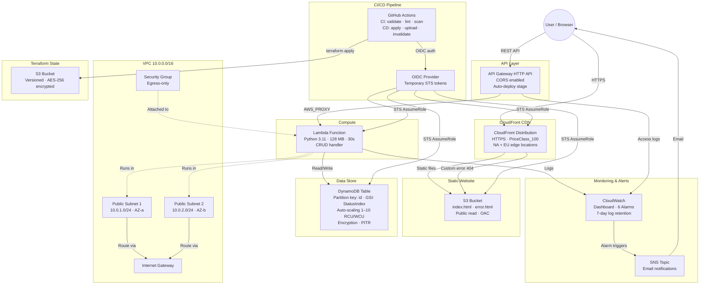
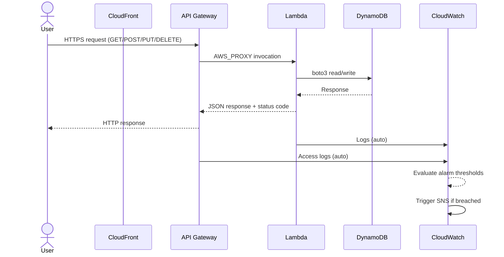
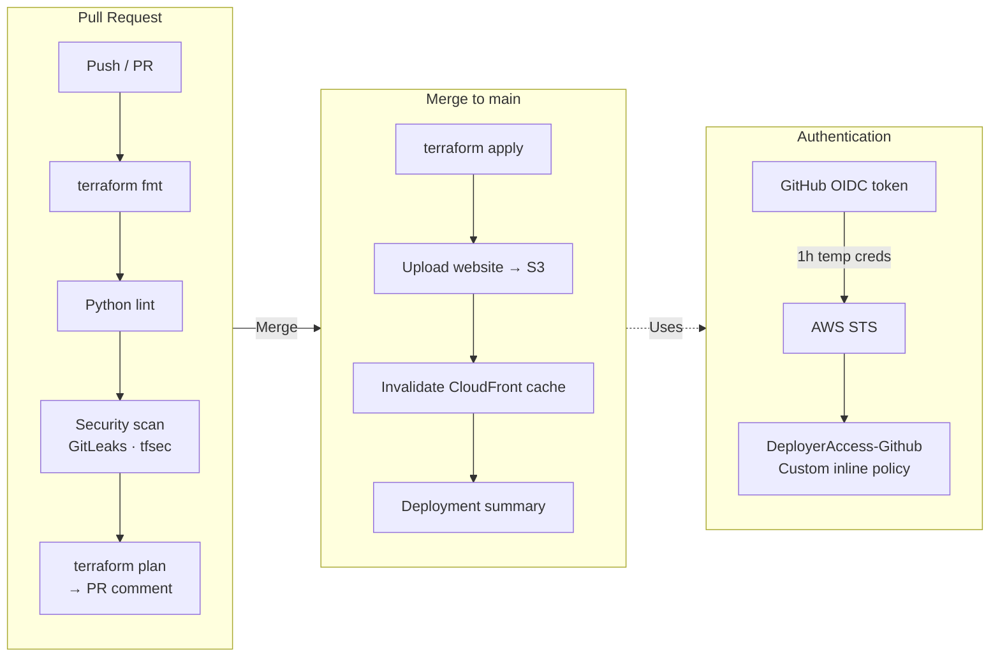
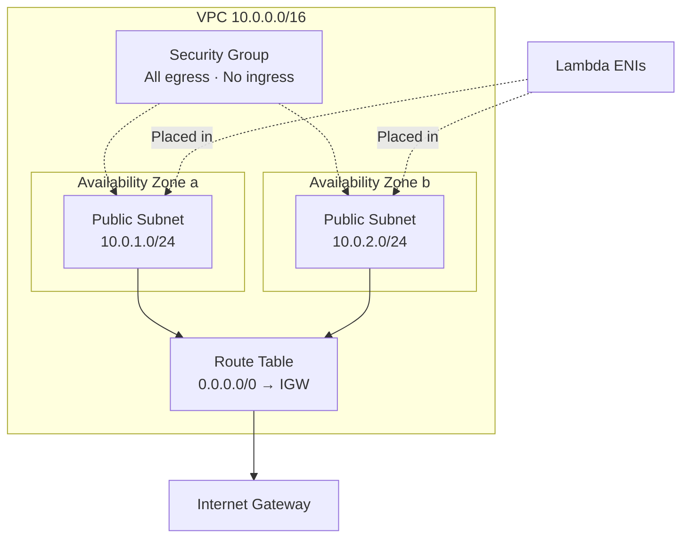
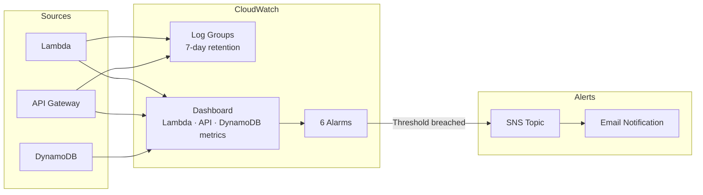
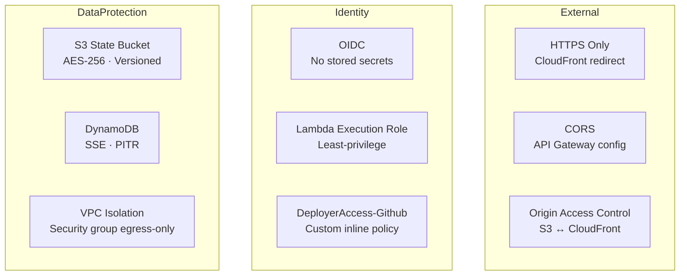

# AWS Infrastructure Automation — Architecture

> A visual guide to every component and how they connect. No code reading required.

---

## High-Level Architecture

---

## Request Flow — API Call

---

## CI/CD Pipeline

---

## Networking

---

## Monitoring & Alerting

| Alarm | Metric | Threshold |
|-------|--------|-----------|
| Lambda Errors | `Errors` sum / 5 min | > 5 |
| Lambda Duration | `Duration` avg / 5 min | > 25 s |
| Lambda Throttles | `Throttles` sum / 5 min | > 10 |
| API 5XX Errors | `5XXError` sum / 5 min | > 10 |
| DynamoDB Read | `ConsumedReadCapacityUnits` / 5 min | > 80% |
| DynamoDB Write | `ConsumedWriteCapacityUnits` / 5 min | > 80% |

---

## Security Layers

---

## Terraform File Map

| File | Creates |
|------|---------|
| `main.tf` | Provider config, S3 remote backend |
| `variables.tf` | Input variables (region, project name, email) |
| `outputs.tf` | URLs, ARNs, resource IDs |
| `vpc.tf` | VPC, 2 public subnets, IGW, route table, security group |
| `s3.tf` | Website bucket + policy, Terraform state bucket (versioned, encrypted) |
| `lambda.tf` | Lambda function, IAM role/policy, API Gateway HTTP API, routes, stage |
| `dynamodb.tf` | DynamoDB table, GSI, auto-scaling targets + policies |
| `cloudfront.tf` | CloudFront distribution, OAC, S3 bucket policy update |
| `monitoring.tf` | SNS topic, 6 CloudWatch alarms, dashboard |

---

## Cost — $0/month

| Service | Free Tier Limit | Project Usage |
|---------|----------------|---------------|
| Lambda | 1M req + 400K GB-s | Minimal |
| DynamoDB | 25 GB, 25 RCU/WCU | 5 RCU/WCU, auto-scale to 10 |
| S3 | 5 GB, 20K GET | 2 HTML files |
| CloudFront | 1 TB transfer, 10M req | Portfolio traffic |
| API Gateway | 1M calls | Demo usage |
| CloudWatch | 10 alarms, 5 GB logs | 6 alarms, 7-day retention |
| SNS | 1M publishes | Alert emails only |
| VPC | Free (no NAT) | 2 public subnets |
